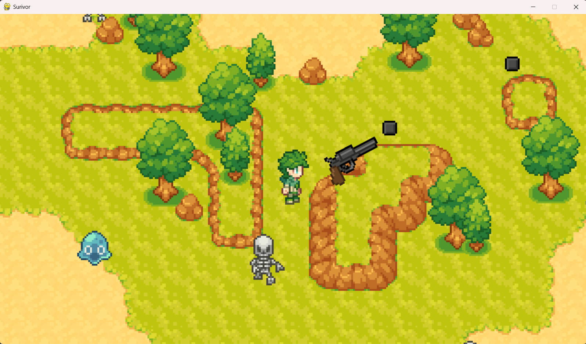
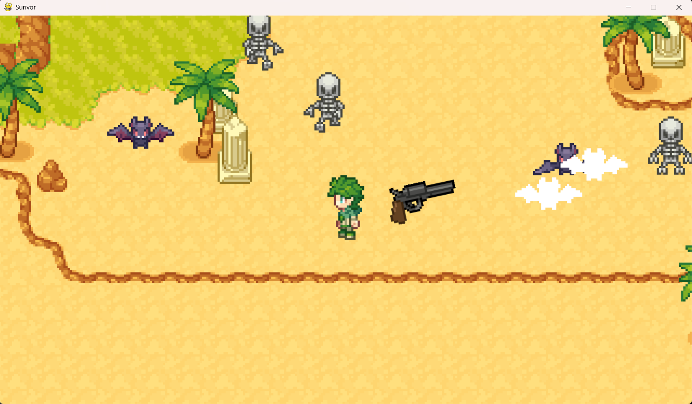

# 🗡️ Survivor

A top-down survivor shooter built with Python and Pygame

## Screenshots



<br/>



## Gameplay

Survive waves of enemies by shooting them down before they reach you.

- **WASD / Arrow keys** — Move the player
- **Left click / Spacebar** — Shoot

## Features

- Smooth player movement with directional animation (up, down, left, right)
- Mouse-aimed gun that rotates and fires bullets independently of movement
- Multiple animated enemy types that chase the player
- Pixel-perfect collision detection using masks
- Enemy death animations
- Tilemap-based world built with Tiled, loaded via pytmx
- Camera system that follows the player
- Collision system for walls and objects
- Background music and sound effects

## Requirements

- Python 3.x
- Pygame
- pytmx

```bash
pip install pygame pytmx
```

## Running the Game

```bash
python main.py
```

Make sure the `images/`, `audio/`, and `data/` directories are present alongside `main.py`.

## Project Status

This project is currently on hold while I focus on other work. Planned future additions include health bars, damage, and extra levels.
